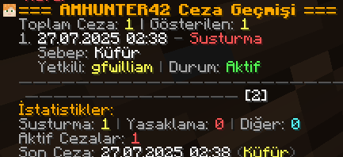
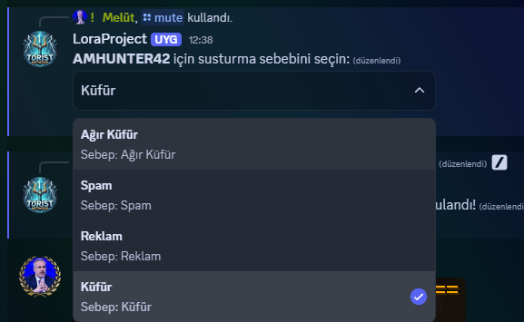
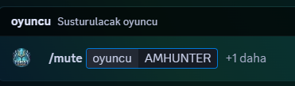
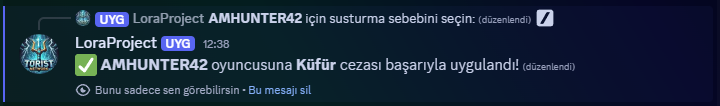
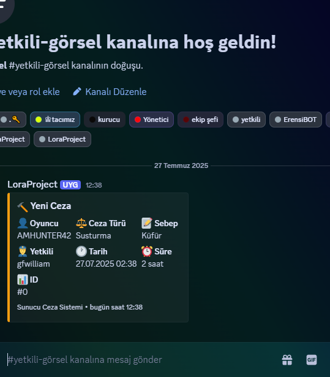
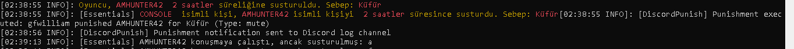

# DiscordPunishBot

!!!**For now, the Discord bot only supports the Turkish language. English will be added in future updates.**


**A professional punishment system plugin for managing Minecraft server punishments via Discord integration.**

[**Download link & indirme linki**](https://modrinth.com/plugin/punishsystem)

## ✨ Features

* **Discord Integration**: Issue punishments using Discord slash commands
* **Role-Based Authorization**: Assign specific roles for different punishment types
* **Advanced Database**: Supports SQLite or MySQL
* **Punishment History**: View detailed player punishment records
* **Customizable**: All punishment types and durations can be edited in the config
* **Statistics**: Track server punishment statistics

## 🚀 Installation

### 1. Requirements

* Java 17+
* Spigot/Paper 1.20+
* Essentials plugin
* A Discord bot

### 2. Plugin Installation

1. Drop the `DiscordPunishBot.jar` into your `plugins` folder
2. Start the server (config files will be generated on first run)
3. Stop the server

### 3. Discord Bot Setup

1. Go to [Discord Developer Portal](https://discord.com/developers/applications)
2. Create a new application
3. Go to the "Bot" tab and create the bot
4. Copy the bot token
5. Go to "OAuth2" > "URL Generator":

   * Scopes: `bot`, `applications.commands`
   * Bot Permissions: `Send Messages`, `Use Slash Commands`, `Read Message History`
6. Use the generated URL to add the bot to your server

### 4. Configuration

Edit the `config.yml` file:

```yaml
discord:
  token: "PUT_BOT_TOKEN_HERE"
  guild-id: "PUT_SERVER_ID_HERE"
  log-channel-id: "PUT_LOG_CHANNEL_ID_HERE"
  roles:
    mute: "MUTE_ROLE_ID"
    ban: "BAN_ROLE_ID"
    other: "OTHER_ROLE_ID"
```

### 5. Getting Channel and Role IDs

1. Enable Developer Mode in Discord (User Settings > Advanced > Developer Mode)
2. Right click on the role or channel and select "Copy ID"
3. Paste these IDs into your `config.yml`

**Log Channel**: Use the ID of the channel where punishment logs will be sent.

## 🎮 Usage

### Discord Commands

* `/mute <player> [reason]` - Mute a player
* `/ban <player> [reason]` - Ban a player
* `/diger <player> [reason]` - Other types of punishments
* `/ceza <player>` - View a player's punishment history

### Minecraft Commands

* `/ceza <player>` - View punishment history of a player
* `/dpunish reload` - Reload the configuration
* `/dpunish info` - Plugin information
* `/dpunish test <database/discord>` - Test the connections
* `/dpunish stats` - Server statistics

## ⚙️ Customizing Punishment Types

You can customize punishment types in the config:

```yaml
punishments:
  mute:
    new-reason:
      command: "essentials:mute %player% 5h %reason%"
      display: "New Reason"
```

### Placeholders

* `%player%` - Name of the punished player
* `%reason%` - Reason for punishment
* `%admin%` - Admin who issued the punishment

## 🗃️ Database

### SQLite (Default)

```yaml
database:
  type: "sqlite"
```

### MySQL

```yaml
database:
  type: "mysql"
  host: "localhost"
  port: 3306
  database: "punishments"
  username: "user_name"
  password: "password"
```

## 🛠️ Development

### Project Structure

```
src/main/java/com/example/discordpunish/
├── DiscordPunishBot.java          # Main plugin class
├── commands/
│   ├── CezaCommand.java           # /ceza command
│   └── DPunishCommand.java        # /dpunish command
├── database/
│   └── DatabaseManager.java      # Database manager
├── discord/
│   └── DiscordBot.java           # Discord bot
├── managers/
│   ├── ConfigManager.java        # Config manager
│   └── PunishmentManager.java    # Punishment manager
└── models/
    └── Punishment.java           # Punishment model
```

### Build

```bash
mvn clean package
```

## 📊 Statistics

The plugin tracks the following statistics:

* Total number of punishments
* Breakdown by punishment type
* Daily punishment counts
* Number of punished players
* Punishment history per player

## 🔧 Troubleshooting

### Bot Not Connecting

1. Make sure your token is correct
2. Ensure the bot is added to your server
3. Verify the bot has required permissions

### Commands Not Working

1. Check if role IDs are correctly set
2. Ensure user has the required role
3. Test connection using `/dpunish test discord`

### Database Errors

1. Test connection with `/dpunish test database`
2. Verify database credentials (for MySQL)
3. Check file permissions (for SQLite)

## 📝 Changelog

### v1.0.0

* Initial release
* Discord slash commands
* Punishment history system
* SQLite/MySQL support
* Customizable punishment types

## 📄 License

This project is licensed under the MIT License.

## 🤝 Contributing

1. Fork this repository
2. Create a feature branch (`git checkout -b feature/new-feature`)
3. Commit your changes (`git commit -am 'Add new feature'`)
4. Push your branch (`git push origin feature/new-feature`)
5. Open a Pull Request

## 📞 Support

If you need help:

* [Use GitHub Issues] (https://github.com/amhunter1/punishsystem)
* [Join our Discord](https://discord.com/users/871721944268038175)
* [Contact via email](gfwilliamtr@gmail.com)

---

**DiscordPunishBot** - A professional punishment management system for your Minecraft server.


# DiscordPunishBot

Discord üzerinden Minecraft sunucunuzda ceza sistemi yönetebileceğiniz profesyonel bir plugin.

[**Download link & indirme linki**](https://modrinth.com/plugin/punishsystem)

## ✨ Özellikler

- **Discord Entegrasyonu**: Discord slash komutları ile ceza verme
- **Rol Bazlı Yetkilendirme**: Farklı ceza türleri için farklı roller
- **Gelişmiş Veritabanı**: SQLite veya MySQL desteği
- **Ceza Geçmişi**: Oyuncuların detaylı ceza kayıtları
- **Özelleştirilebilir**: Tüm ceza türleri ve süreleri config'ten ayarlanabilir
- **İstatistikler**: Sunucu ceza istatistikleri

## 📸 Önizleme

**Oyun içi /ceza <oyuncu> örneği**


**Admin paneli 1**


**Admin paneli 2**


**Admin paneli 3**


**Discord log mesajı örneği**


**Sunucu konsol mesaj örneği**



## 🚀 Kurulum

### 1. Gereksinimler
- Java 17+
- Spigot/Paper 1.20+
- Essentials plugin
- Discord botu

### 2. Plugin Kurulumu
1. `DiscordPunishBot.jar` dosyasını `plugins` klasörüne atın
2. Sunucuyu başlatın (ilk başlatmada config dosyaları oluşacak)
3. Sunucuyu durdurun

### 3. Discord Bot Kurulumu
1. [Discord Developer Portal](https://discord.com/developers/applications)'a gidin
2. Yeni bir uygulama oluşturun
3. "Bot" sekmesine gidin ve bot oluşturun
4. Bot token'ını kopyalayın
5. "OAuth2" > "URL Generator" sekmesinden:
   - Scopes: `bot`, `applications.commands`
   - Bot Permissions: `Send Messages`, `Use Slash Commands`, `Read Message History`
6. Oluşan URL ile botu sunucunuza ekleyin

### 4. Konfigürasyon
`config.yml` dosyasını düzenleyin:

```yaml
discord:
  token: "BOT_TOKEN_BURAYA"
  guild-id: "SUNUCU_ID_BURAYA"
  log-channel-id: "LOG_KANAL_ID_BURAYA"  # Ceza loglarının gönderileceği kanal
  roles:
    mute: "MUTE_YETKISI_ROL_ID"
    ban: "BAN_YETKISI_ROL_ID"
    other: "DIGER_YETKISI_ROL_ID"
```

### 5. Kanal ve Rol ID'lerini Alma
1. Discord'da Developer Mode'u aktifleştirin (User Settings > Advanced > Developer Mode)
2. Role veya kanala sağ tıklayıp "Copy ID" seçin
3. ID'leri config.yml'e yapıştırın

**Log Kanalı**: Ceza loglarının otomatik olarak gönderileceği kanal ID'sini `log-channel-id` kısmına yazın.

## 🎮 Kullanım

### Discord Komutları
- `/mute <oyuncu> [sebep]` - Oyuncuyu sustur
- `/ban <oyuncu> [sebep]` - Oyuncuyu yasakla
- `/diger <oyuncu> [sebep]` - Diğer ceza türleri
- `/ceza <oyuncu>` - Ceza geçmişini görüntüle

### Minecraft Komutları
- `/ceza <oyuncu>` - Oyuncunun ceza geçmişini görüntüle
- `/dpunish reload` - Konfigürasyonu yeniden yükle
- `/dpunish info` - Plugin bilgileri
- `/dpunish test <database/discord>` - Bağlantıları test et
- `/dpunish stats` - Sunucu istatistikleri

## ⚙️ Ceza Türleri Özelleştirme

Config'te ceza türlerini özelleştirebilirsiniz:

```yaml
punishments:
  mute:
    yeni-sebep:
      command: "essentials:mute %player% 5h %reason%"
      display: "Yeni Sebep"
```

### Placeholder'lar
- `%player%` - Cezalı oyuncu adı
- `%reason%` - Ceza sebebi
- `%admin%` - Cezayı veren yetkili

## 🗃️ Veritabanı

### SQLite (Varsayılan)
```yaml
database:
  type: "sqlite"
```

### MySQL
```yaml
database:
  type: "mysql"
  host: "localhost"
  port: 3306
  database: "punishments"
  username: "kullanici_adi"
  password: "sifre"
```

## 🛠️ Geliştirme

### Proje Yapısı
```
src/main/java/com/example/discordpunish/
├── DiscordPunishBot.java          # Ana plugin sınıfı
├── commands/
│   ├── CezaCommand.java           # /ceza komutu
│   └── DPunishCommand.java        # /dpunish komutu
├── database/
│   └── DatabaseManager.java      # Veritabanı yönetimi
├── discord/
│   └── DiscordBot.java           # Discord bot
├── managers/
│   ├── ConfigManager.java        # Konfigürasyon yönetimi
│   └── PunishmentManager.java    # Ceza sistemi
└── models/
    └── Punishment.java           # Ceza modeli
```

### Build Etme
```bash
mvn clean package
```

## 📊 İstatistikler

Plugin aşağıdaki istatistikleri tutar:
- Toplam ceza sayısı
- Ceza türlerine göre dağılım
- Günlük ceza sayısı
- Cezalı oyuncu sayısı
- Oyuncu başına ceza geçmişi

## 🔧 Sorun Giderme

### Bot Bağlanmıyor
1. Token'ın doğru olduğundan emin olun
2. Bot'un sunucuya eklendiğini kontrol edin
3. Bot'un gerekli izinlere sahip olduğunu kontrol edin

### Komutlar Çalışmıyor
1. Rol ID'lerinin doğru olduğundan emin olun
2. Kullanıcının gerekli role sahip olduğunu kontrol edin
3. `/dpunish test discord` ile bağlantıyı test edin

### Veritabanı Hataları
1. `/dpunish test database` ile bağlantıyı test edin
2. MySQL kullanıyorsanız bağlantı bilgilerini kontrol edin
3. Dosya izinlerini kontrol edin (SQLite için)

## 📝 Değişiklik Geçmişi

### v1.0.0
- İlk sürüm yayınlandı
- Discord slash komutları
- Ceza geçmişi sistemi
- SQLite/MySQL desteği
- Özelleştirilebilir ceza türleri

## 📄 Lisans

Bu proje MIT lisansı altında lisanslanmıştır.

## 🤝 Katkıda Bulunma

1. Bu repository'yi fork edin
2. Feature branch oluşturun (`git checkout -b feature/yeni-ozellik`)
3. Değişikliklerinizi commit edin (`git commit -am 'Yeni özellik eklendi'`)
4. Branch'inizi push edin (`git push origin feature/yeni-ozellik`)
5. Pull Request oluşturun

## 📞 Destek

Herhangi bir sorun yaşarsanız:
- GitHub Issues kullanın
- [Discord sunucumuza katılın](https://discord.com/users/871721944268038175)
- [E-posta ile iletişime geçin](gfwilliamtr@gmail.com)

---

**DiscordPunishBot** - Minecraft sunucunuz için profesyonel ceza yönetim sistemi.
